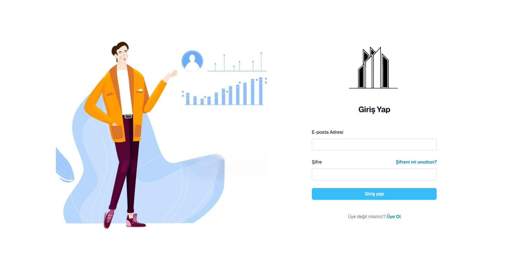
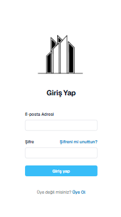

# React & Tailwind

This is a [Next.js](https://nextjs.org) project bootstrapped with [`create-next-app`](https://github.com/vercel/next.js/tree/canary/packages/create-next-app).

## Getting Started

First, run the development server:

```bash
npm run dev
# or
yarn dev
# or
pnpm dev
# or
bun dev
```

Open [http://localhost:3000](http://localhost:3000) with your browser to see the result.


# Login Page
<a href="https://login-ui-nu.vercel.app/" target="_blank">Ön İzleme</a>

Masaüstü Görünüm


Mobil Görünüm <br />
